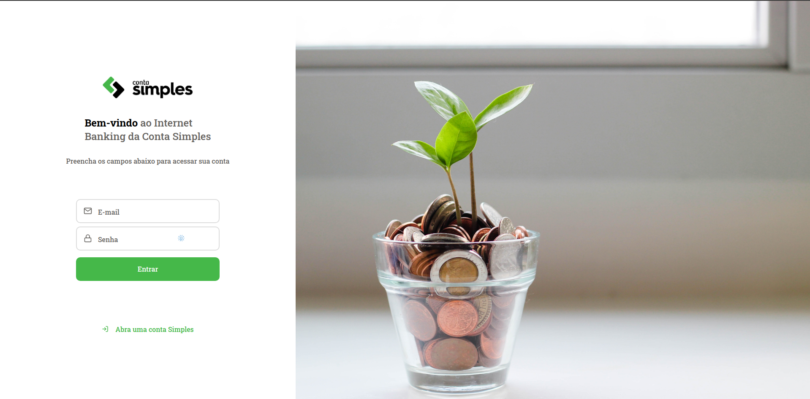
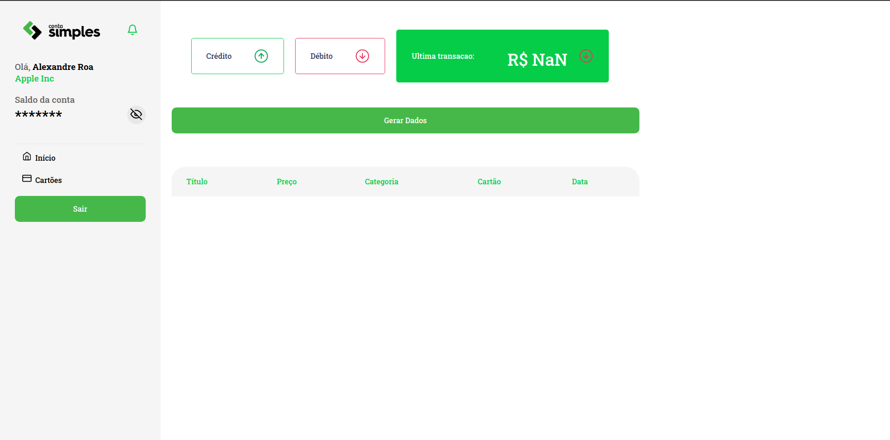
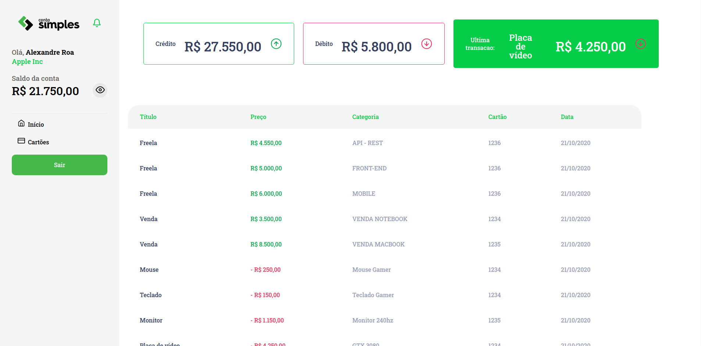
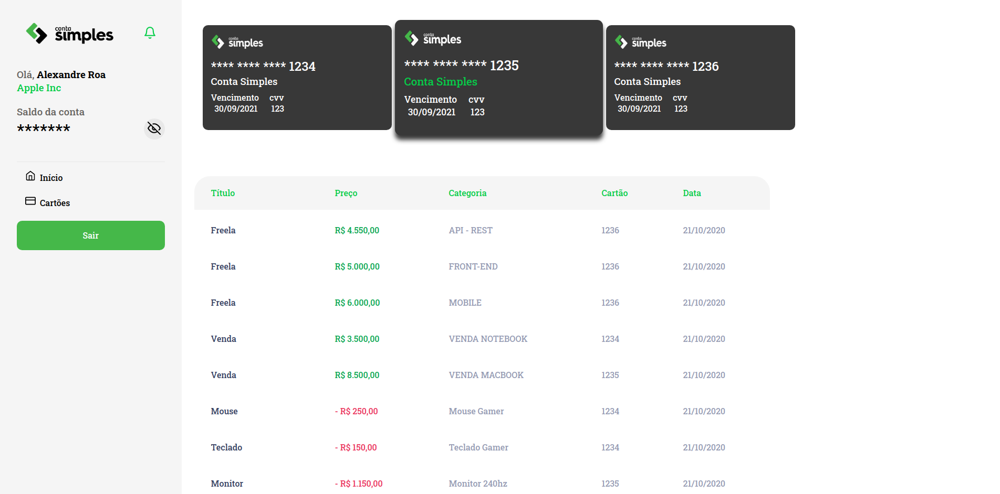

# TESTE CONTA SIMPLES

## Como rodar a aplicação

Para rodar a aplicação é necessário seguir alguns passos:

### Backend

1 - Clonar esse repositório copiando e colando o código abaixo;

```sh
git clone https://github.com/alexandre-roa/test-contasimples-Fullstack-.git
```

2 - Após isso, acessar a pasta do repositório e rodar o backend;

```sh
cd test-contasimples-Fullstack-/backend
```

3 - Em seguida é necessário instalar as dependências com yarn rodando o comando:

```sh
yarn
```
Caso não tenha o yarn instalado basta rodar o comando a seguir
```sh
npm install -g yarn
```

4 - Depois de instalar as dependências, é só rodar a aplicação colando o comando a seguir no console:

```sh
yarn dev:server
```

### Frontend

Para rodar a aplicação no frontend basta acessar o link a seguir ou rodar a aplicação direto da sua máquina

[Acessar aplicação Frontend](https://conta-simples-code-test.vercel.app/)

1 - Para rodar a aplicação localmente, basta acessar a pasta <strong>frontend</strong> desse repositório e rodar os seguintes comandos:

```sh
yarn
```

```sh
yarn start
```
O primeiro comando se refere a instalação das dependências e o segundo serve para rodar a aplicação.

## Acessando a aplicação

Após as versões estarem rodando tanto no frontend quanto no backend, basta acessar a home page da aplicação.

A home page consiste em uma tela de login conforme a seguir:

<div align="center" >
  
</div>

<br></br>
Para acessar a aplicação você pode utilizar os seguintes dados:
<br></br>

```sh
email: alexandre@contasimples.com.br
senha: 123456
```
Ou se prefererir pode realizar um cadastro você mesmo utilizando o link de criar a conta, assim esse link irá te levar a pagina de cadastro:

<div align="center" >
  
</div>

<br></br>
Após realizar o login, você será redirecionado a pagina da dashboard, na qual terá um botão <strong>Gerar dados</strong>, clicando nesse link automaticamente a pagina irá carregar com os dados para utilizar a aplicação:
<br></br>

<div align="center" >
  
</div>

<br></br>
Após carregado, irá ficará conforme a imagem abaixo, podendo filtrar por transações somente crédito ou débito e última transação. Esconder ou mostrar o saldo atual da conta e a opção de acessar a página de cartões:
<br></br>

<div align="center" >
  
</div>

<br></br>
Na pagina de cartões, tera o detalhamento das transações por cartão, basta escolher o cartão desejado.
<br></br>

<div align="center" >
  
</div>

<br></br>
## 🚀 Tecnologias Utilizadas

- ✔️ Typescript

- ✔️ ReactJS

- ✔️ React Hooks

- ✔️ Context Api

- ✔️ NodeJS

- ✔️ React Hooks

- ✔️ Mongodb

- ✔️ Axios

- ✔️ TypeORM

- ✔️ Docker

## Testes da aplicação

Foi realizado testes no backend, TDD utilizando jest, porém não foi realizado uma cobertura completa, pelo fato de ter me focado em apresentar todas as features.

## Para ver os detalhes de cada desafio, basta acessar os links

[Backend - API](https://github.com/alexandre-roa/test-contasimples-Fullstack-/tree/master/backend)

[Frontend](https://github.com/alexandre-roa/test-contasimples-Fullstack-/tree/master/frontend)